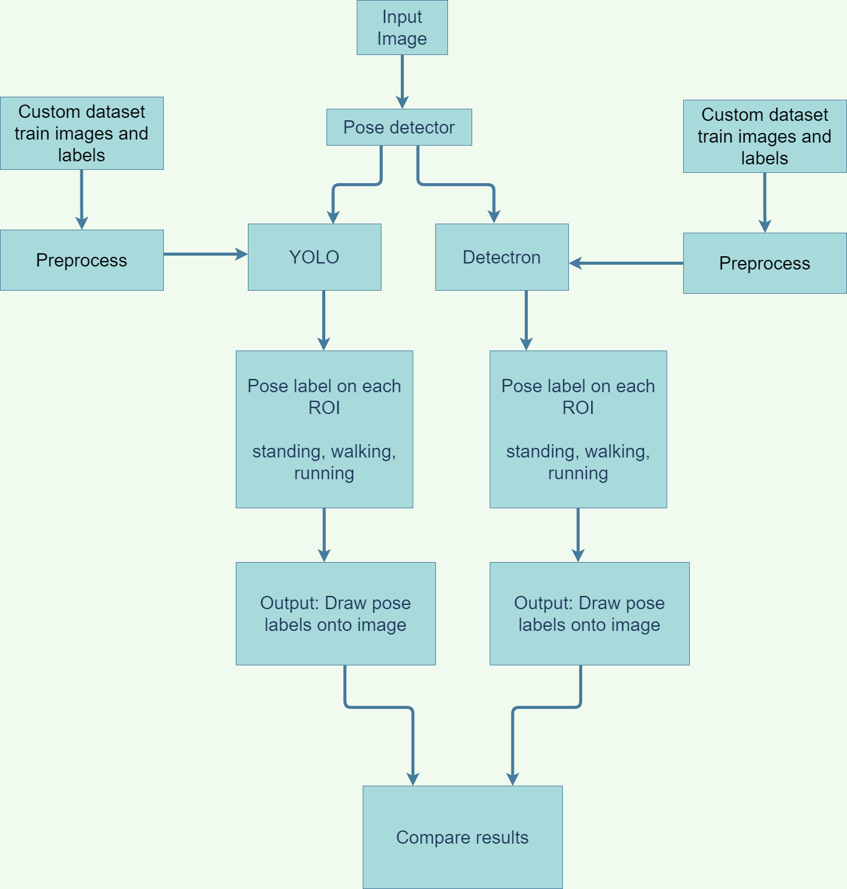

# CMPE_258_Group_Project

## Setup
#### YOLOv4 object detector
Use [this linked README](https://github.com/hualili/opencv/blob/master/deep-learning-2020S/20-2021S-7c-%23README-yolo4-v2-yy-hl-2021-4-5%20(copy).txt) to setup and run pre-trained YOLOv4 in `tensorflow-yolov4-tflite-master`.

Follow instructions to setup Anaconda environment, 
download yolov4.weights, 
and convert the weights from DarkNet to TensorFlow.
Need to save and convert weights on local computer since the yolov4.weights and checkpoint folder are over 200MB, too large to push. 

#### YOLOv3 pose detector
Then follow [subfolder README](TrainYourOwnYOLO) to setup and run YOLOv3 in `TrainYourOwnYOLO`.
For example, used conda to create virtual environment `yolov3-env` and `pip install` in the environment to install requirements:
```
cd TrainYourOwnYOLO
conda create --name yolov3-env
conda activate yolov3-env
pip install -r requirements.txt
python Minimal_Example.py
```
##### Download dataset
The folder `Activities.v4-activitiesset2.0.yolokeras` is from the [MPII human pose dataset](http://human-pose.mpi-inf.mpg.de/#overview). 
It is labeled with bounding boxes using [Roboflow exported as Keras YOLO txt format](https://roboflow.com/formats/yolo-keras-txt) 
The dataset is also available in [this folder](https://drive.google.com/file/d/1eRMz4SQCKbh0yGwTJuZb_PUUbjPxv_U2/view).

It is used to train YOLOv3.

##### Copy dataset text files and images to YOLOv3 folder
1. Copy-paste `train` folder into `TrainYourOwnYOLO/Data/Source_Images/Training_Images`
2. Rename the `train` folder to `vott-csv-export`.
3. Rename `_classes.txt` to `data_classes.txt` and move into the folder `TrainYourOwnYOLO/Data/Model_Weights`.
4. Run the script `prepend-absolute-path-to-data-train`.
This creates a new file `data_train.txt` and prepends the absolute path of the train images folder to each line of the file.
5. Delete `_annotations.txt`

##### Download trained YOLOv3 model
Download the folder with trained YOLOv3 model from link below, unzip, and replace `TrainYourOwnYOLO/Data/Model_Weights` with it.
- [trained on Activities.v4-activitiesset2.0.yolokeras]()

---
The folder `activities-dataset` is from the [MPII human pose dataset](http://human-pose.mpi-inf.mpg.de/#overview). 
It is labeled with bounding boxes and used to train YOLOv3. 
Unzip [this folder](https://drive.google.com/file/d/17bsXYzBf6PhBrvgWAe0m-vhhBApgE8ys/view?usp=sharing).

##### Copy YOLOv3 training CSV file and images
Copy folder `vott-csv-export` from the unzipped folder and paste in `TrainYourOwnYOLO/Data/Source_Images/Training_Images`.
Change `data_train.txt` image paths to your own computer's paths if error occurs when running.

##### Download trained YOLOv3 model
Download the folder with trained YOLOv3 model from link below, unzip, and replace `TrainYourOwnYOLO/Data/Model_Weights` with it.
- [trained on activities-dataset](https://drive.google.com/file/d/1ABMsxLCVtqVHHdSw3DS-SUrR25YIc-dG/view?usp=sharing)
---

## Run
Assuming virtual environments were created and named `yolov4-cpu` and `yolov3-env`.
Label poses of people in `tensorflow-yolov4-tflite-master/data/images/frame0000.jpg`
```
# run YOLOv4 to get person bounding boxes
cd tensorflow-yolov4-tflite-master/
conda activate yolov4-cpu
python detect.py --weights ./checkpoints/yolov4-416 --size 416 --model yolov4 --images ./data/images/frame0000.jpg

# run YOLOv3 to get images with pose labels
cd ../TrainYourOwnYOLO
conda activate yolov3-env
cd 3_Inference
python Detector.py
# combine images into a video and show it
python create_video_from_images.py
```
## Output
You should get the following output:
- individual person boxes (ROIs) in `rois` folder
- processed ROIs in `rois_resized` and `TrainYourOwnYOLO/Data/Test_Images` folders
- detection results in `TrainYourOwnYOLO/Data/Source_Images/Test_Image_Detection_Results`
- results combined in a video in `TrainYourOwnYOLO/video.avi`

## Results
Graph, video, and detected image results can be found in [results](results) folder.

View graphs in TensorBoard.dev:
- [YOLOv3 training on images in human-pose-dataset](https://tensorboard.dev/experiment/sJyULVIYTXqtNboXkLK2Ag/)
- [YOLOv3 training on images in activities-dataset](https://tensorboard.dev/experiment/TvTwCjCJSRG90rw4c0ZYew/)
- [YOLOv3 training on images in Activities.v4-activitiesset2.0.yolokeras](https://tensorboard.dev/experiment/OZ1Do5lxQ3ODDwD4Jduzmw/)

## Development Instructions
Follow setup instructions and run.

If want to train manually, follow [training instructions](yolov3-training.txt)

##### More info:
- changed `tensorflow-yolov4-tflite-master/core/utils.py` to get bounding box images of person class only
- example Colab detecting person, getting box images, and running pose detector to label poses:
https://colab.research.google.com/drive/1w-97X3vivhkl-bLhTFRI4b56ACK-G9Ui?usp=sharing

## Architecture
